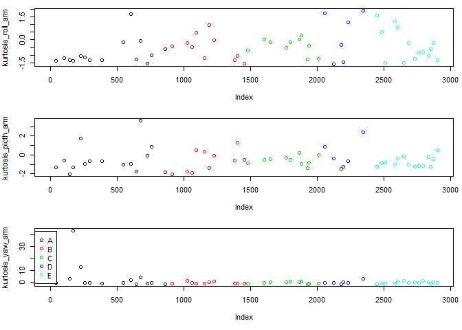

# Predicting Exercise Form through Movement Sensor Data
LaurenR  
January 10, 2016  
The purpose of this exercise is to use machine learning to create an algorithm that can predict how a subject is performing a bicep curl using data collected from movement sensors. The dataset includes 6 participants, all of whom wore sensors while preforming a bicep curl in 5 different ways. Classe A is considered proper form, while B-E are an approximation of common mistakes. The aim of this algorithm is to take activity tracking beyond simply recording movement and begin to provide the user with feedback on the quality of their movement. Packages used: caret, base plotting

Data is provided by http://groupware.les.inf.puc-rio.br/har  Credit given to: Velloso, E.; Bulling, A.; Gellersen, H.; Ugulino, W.; Fuks, H. Qualitative Activity Recognition of Weight Lifting Exercises. Proceedings of 4th International Conference in Cooperation with SIGCHI (Augmented Human '13) . Stuttgart, Germany: ACM SIGCHI, 2013.

*We start by dividing the training dataset into a crossvalidation set of 75% training, 25% testing.*

```
## Warning: package 'caret' was built under R version 3.2.2
```

```
## Warning: package 'lattice' was built under R version 3.2.1
```

```
## Warning: package 'ggplot2' was built under R version 3.2.1
```

```r
setwd("C:/Users/Lauren/Documents/Machine Learning/ProjectData")
trainData <- read.csv("pml-training.csv", stringsAsFactors = FALSE)
testData <- read.csv("pml-testing.csv", stringsAsFactors = FALSE)
intrainingA <- createDataPartition(y=trainData$classe, p=0.75, list=FALSE)
trainA <- trainData[intrainingA,]
testA <- trainData[-intrainingA,]
dim(trainA)
```

```
## [1] 14718   160
```
*Exploratory analysis can be conducted on our training dataset to identify potential predictors for use in the model.*

```r
names(trainA)[1:20]
```

```
##  [1] "X"                    "user_name"            "raw_timestamp_part_1"
##  [4] "raw_timestamp_part_2" "cvtd_timestamp"       "new_window"          
##  [7] "num_window"           "roll_belt"            "pitch_belt"          
## [10] "yaw_belt"             "total_accel_belt"     "kurtosis_roll_belt"  
## [13] "kurtosis_picth_belt"  "kurtosis_yaw_belt"    "skewness_roll_belt"  
## [16] "skewness_roll_belt.1" "skewness_yaw_belt"    "max_roll_belt"       
## [19] "max_picth_belt"       "max_yaw_belt"
```
The goal is to predict the Classe variable found in column 160 using the relevant 159 other variables. Let's look at the distribution of the classe variable.

```r
table(trainA$classe)
```

```
## 
##    A    B    C    D    E 
## 4185 2848 2567 2412 2706
```
Most of the data is for Classe A with B-E pretty evenly distributed. A represents
proper technique while B-E are each a common error.
We will change the Classe variable to a factor for easier graphing and look at the user_name category to see how data is distributed among participants

```r
trainA$classe <- as.factor(trainA$classe)
table(trainA$user_name)
```

```
## 
##   adelmo carlitos  charles   eurico   jeremy    pedro 
##     2902     2331     2647     2293     2565     1980
```
There are six users, all pretty evenly accounted for in the data. Let's look
at adelmo for any patterns. Looking at only one subject may also protect against overfitting and allow for easier pattern recognition in our graphs.

```r
adelmo <- subset(trainA, user_name == "adelmo")
dim(adelmo)
```

```
## [1] 2902  160
```
Let's try to graph "gyros_dumbbell_x/y/x" color coded by our outcome, x/y/z movement seems like it will give the most movement information.
\

These variables all show patterns that are distinct for each outcome.

Let's graph the accel_dumbbell variable in the x,y,z to see if it also shows patterns.
\

We will assume that the x/y/z movement data are relevant predictors, not only are they showing distinct patterns, but there is a good amount of data for each. Let's graph the kurosis measure for the dumbbell to see if this shows a pattern as well.


```r
par(mfrow=c(3,1), mar= c(5,4,1,1))
plot(adelmo[,69], col=adelmo$classe, ylab=names(adelmo[69]))
plot(adelmo[,70], col=adelmo$classe, ylab=names(adelmo[70]))
plot(adelmo[,71], col=adelmo$classe, ylab=names(adelmo[71]))
```

```
## Warning in xy.coords(x, y, xlabel, ylabel, log): NAs introduced by coercion
```

```r
legend("left", legend=unique(adelmo$classe), col=unique(adelmo$classe), pch=1)
```

\

Less of a pattern is shown with this variable and data points are much more scarce.
The x/y/z measures of each sensor may include enough data to adequately inform our model, we will subset only those variables.


```r
xyz <- grep("_x$|_y$|_z$", names(adelmo))
adelmoXYZ <- adelmo[,c(xyz,160)]
dim(adelmoXYZ)
```

```
## [1] 2902   37
```

```r
any(is.na(adelmoXYZ))
```

```
## [1] FALSE
```

We now have a smaller data frame without any missing data.

Now we will subset our larger trainA dataset that includes all participants and look at the dendogram. We can see that classification at this level is fruitful.


```r
trainAxyz <- trainA[,c(xyz, 160)]
mdist1 <- dist(trainAxyz[,1:3])
hclustering1 <- hclust(mdist1)
plot(hclustering1)
```

\

From here we will train a model using Principal Component Analysis in preprocessing, and K Nearest Neighbor method. It can be assumed that many of the x/y/z movements are highly correlated with one another and using PCA should reduce the noise and produce a more effective and efficient model.

```r
set.seed(500)
modelFit <- train(classe ~ ., preProcess="pca", data=trainAxyz,method="knn")
modelFit$finalModel
```

```
## 5-nearest neighbor classification model
## Training set class distribution:
## 
##    A    B    C    D    E 
## 4185 2848 2567 2412 2706
```

```r
predictions <- predict(modelFit, newdata= testA)
confusionMatrix(predictions, testA$classe)
```

```
## Confusion Matrix and Statistics
## 
##           Reference
## Prediction    A    B    C    D    E
##          A 1365   29   14   13    3
##          B    8  881   22    6   12
##          C   11   29  787   30    8
##          D   10    4   27  754    2
##          E    1    6    5    1  876
## 
## Overall Statistics
##                                           
##                Accuracy : 0.9509          
##                  95% CI : (0.9444, 0.9567)
##     No Information Rate : 0.2845          
##     P-Value [Acc > NIR] : < 2e-16         
##                                           
##                   Kappa : 0.9378          
##  Mcnemar's Test P-Value : 0.05145         
## 
## Statistics by Class:
## 
##                      Class: A Class: B Class: C Class: D Class: E
## Sensitivity            0.9785   0.9283   0.9205   0.9378   0.9723
## Specificity            0.9832   0.9879   0.9807   0.9895   0.9968
## Pos Pred Value         0.9586   0.9483   0.9098   0.9460   0.9854
## Neg Pred Value         0.9914   0.9829   0.9832   0.9878   0.9938
## Prevalence             0.2845   0.1935   0.1743   0.1639   0.1837
## Detection Rate         0.2783   0.1796   0.1605   0.1538   0.1786
## Detection Prevalence   0.2904   0.1894   0.1764   0.1625   0.1813
## Balanced Accuracy      0.9808   0.9581   0.9506   0.9637   0.9845
```
When applied to our cross validation training set, the model has a 95% accuracy rate. When applied to new data, our model should have a 5% Out of Sample Error Rate. 
